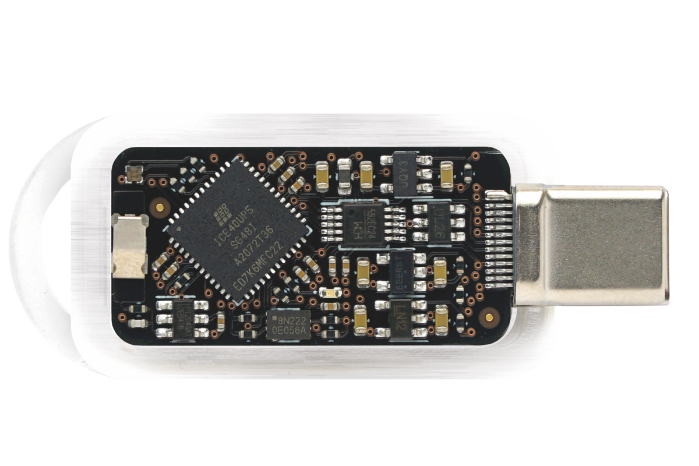

# Tillitis TKey Developer Handbook

Welcome to the TKey Developer Handbook. With this handbook you can
learn how to build and use current TKey device applications (runs on
the TKey itself), their corresponding client applications (runs on a
computer or mobile phone) as well as learn how to develop your own
applications.

The source for this living documentation resides in a <a
href="https://github.com/tillitis/dev-tillitis">repository</a> on
GitHub. You're welcome to contribute by submitting a Pull request, for
example using the convenient "Edit this page" button at the bottom of
every page.

