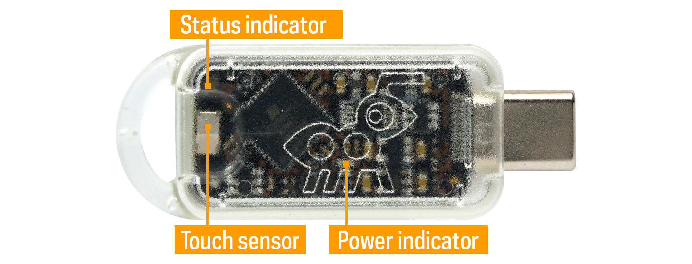

# Introduction



The Tillitis TKey is a small computer in a USB stick form factor that
can run small device applications. The purpose of the TKey is to be a
secure environment for applications that provide some kind of security
function. Some examples of such security functions are:

- Time-based one-time password (TOTP) token generators
- Digital signatures
- Secure random numbers
- Encryption

There is a flash chip with a very simple filesystem on the TKey from
the Castor release. It contains space for two pre-loaded apps and four
storage areas for device apps. On an end-user version the preloaded
apps are a loader app and a FIDO2 app.

## TKey specifications

- 32-bit RISC-V CPU running at 24 MHz
- Execution monitor
- Hardware-assisted address randomization and RAM scrambling
- 128 kiB RAM for TKey device applications
- 4 kiB firmware RAM
- 8 kiB ROM
- True random number generator
- USB CDC, FIDO, HID, and CCID endpoints over a Type-C connector
- Timer
- Two levels of hardware privilege modes: firmware mode and
  application mode
- CPU-controlled LED
- 1 MByte flash, 128 kByte accessible per application.


**Note well**: In the end-user version (not TKey Unlocked) the FPGA
configuration is locked down. This means you cannot change the FPGA
bitstream or read out the bitstream (or the Unique Device Secret, UDS)
from the configuration memory, even if you break the case and insert
it into a programmer board.


## Measured boot & secrets

A unique feature of the TKey is that it measures the loaded device
application before starting it. A hash digest measurement (using
BLAKE2s) combined with a Unique Device Secret (UDS) makes up a base
secret we call a Compound Device Identifier (CDI) which can then used
by the TKey device app.

If the TKey device app is altered in any way the CDI is also changed.
If the keys derived from the CDI are the same as the last time the
given device app was loaded onto the same TKey the device app's
integrity is guaranteed.

The UDS is unique per TKey. The same device app loaded onto another
TKey results in a different CDI.

The key derivation can also include a User Supplied Secret (USS). Then
the keys are based on both something the user has -- the specific TKey
-- and something the user knows -- the USS.

This is the algorithm for the CDI:

```go
cdi = blake2s(UDS, blake2s(device_app), USS)
```

All of the TKey software, firmware, FPGA Verilog source code,
schematics, and PCB design files are released under open
source/hardware licenses, like all trustworthy security software and
hardware should be. This, in itself, makes the TKey different, as
other security tokens use at least some closed source hardware for
security-critical operations.

## Getting Started

* [Get started using your TKey](https://tillitis.se/getstarted).
* [Tools & Libraries](../tools/), setup and introduction for
  application developers.
* [Tkey Unlocked](../unlocked), instructions for the provisioning
process
