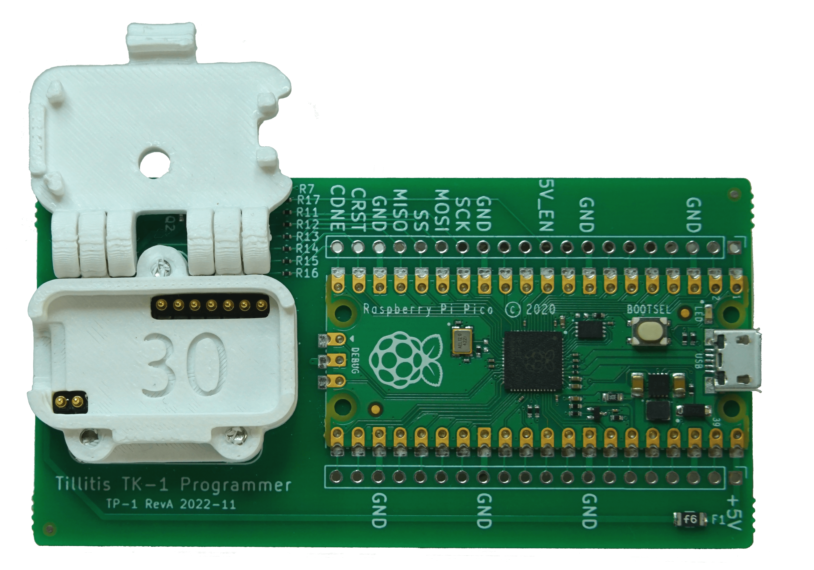

# TKey Programmer

The TKey Programmer (TP) board is a tool used to program the FPGA on a
TKey. It consists of a RPI Pico and a jig where the TKey can be placed.



## General usage

The board is interfaced using USB, and it will display itself as ID
`1209:8886 Generic TP-1`. The TKey is supposed to be placed in the jig
and one closes the lid carefully by pressing in the middle of the jig
(by the hole). To open the lid of the jig, it is easiest to simply
lift up on the lever.

The TP board supports two host computer tools to accommodate
programming of the TKey, either `iceprog` or `pynvcm`. See
instructions at [Program NVCM](unlocked/spiflash) or [Program SPI
flash](unlocked/nvcm). Naturally, you need to have an FPGA bitstream
to program first, see [Build bitstream](unlocked/build).

## Linux device permissions {#linux-permissions}

To allow sudo-less programming, you need to be able to access the TKey
Programmer USB device. This is a raw USB device that is probably not
taken care of by your distribution.

You can install a udev rule that will assign the TKey Programmer to
the dialout group. You will also need to add your user to this group:

Create the following udev rule at `/etc/udev/rules.d`
```
# TP-1 programmer
SUBSYSTEM=="usb", ENV{DEVTYPE}=="usb_device", ATTR{idVendor}=="1209", ATTR{idProduct}=="8886", MODE="0666", GROUP="dialout"
```

To reload the rules run
```
sudo udevadm control --reload-rules
sudo usermod -aG dialout ${USER}
```

To apply the new group, log out and then log back in, or run the
command `newgrp dialout` in the terminal that you are working in.

You can check the device permissions to determine if the group was
successfully applied. First, use `lsusb` to find the location of the
programmer:

```
lsusb -d 1209:8886
Bus 001 Device 023: ID 1209:8886 Generic TP-1
```

Then, you can check the permissions by using the bus and device
numbers reported above. Note that this pair is ephemeral and may
change after every device insertion:

```
ls -l /dev/bus/usb/001/023
crw-rw---- 1 root dialout 189, 22 Feb 16 14:58 /dev/bus/usb/001/023
```

## Onboard firmware

The TP board runs a custom firmware developed by Blinkinlabs. The
source code for this firmware can be found at
[github.com/tillitis/tp1/fw](https://github.com/tillitis/tp1/blob/main/fw).
There is also a pre-built firmware binary at
[github.com/tillitis/tp1/fw/bin](https://github.com/tillitis/tp1/blob/main/fw/bin/main.uf2).

To update the firmware on the programmer board, either build the file
`main.uf2` (more instructions below) or get the pre-built file to your
host computer. Then do the following:

1. Disconnect the programming board from the host computer
2. Press and hold the "BOOTSEL" button on the RPi2040 sub-board on the
programming board
3. Reconnect the programming board to the host computer
4. Release the "BOOTSEL" button after connecting the programming board
to the host. The board should now appear to the host as a USB
connected storage device
5. Open the storage device and drop the firmware file `main.uf2` into
the storage device

The programmer will update its firmware with the file and restart
itself. After rebooting, the storage device will automatically be
disconnected.

### Building the TP firmware

The firmware requires the Raspberry Pi Pico SDK:

```
cd ~
git clone --branch 1.5.1 https://github.com/raspberrypi/pico-sdk.git
cd pico-sdk
git submodule update --init
```

Note that our container image places the pico-sdk directory in
/usr/local. For normal development, it is usually left in the user's
home directory.

See
[tp1/fw/README.md](https://github.com/tillitis/tp1/blob/main/fw/README.md)
for further instructions.

## Hardware

The hardware is, as everything around the TKey is, open source and can
be found here:

https://github.com/tillitis/tp1
