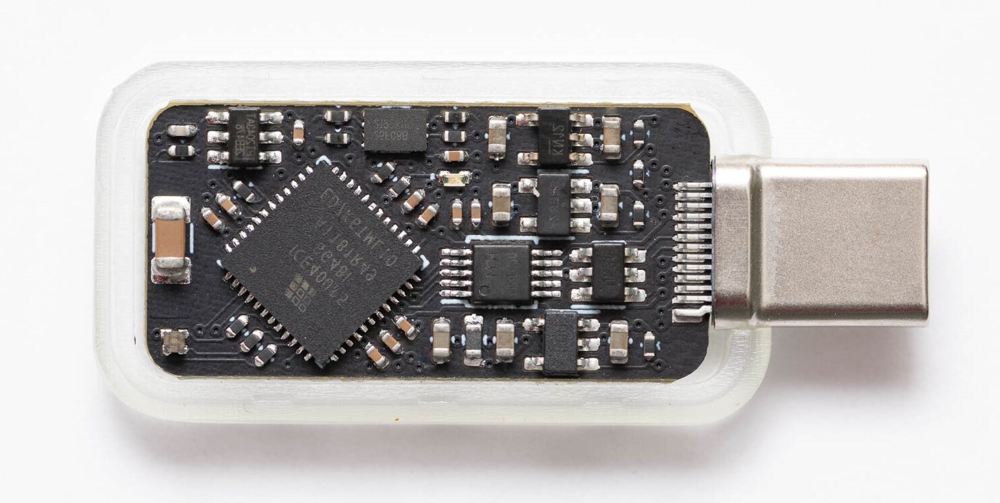

# Tillitis TKey Developer Handbook

Welcome to the TKey Developer Handbook where you can learn how to
build and use the current TKey device applications that run on TKey
and their matching client applications that run on the computer where
the TKey is plugged in (sometimes called the "host"). In this
developer handbook, you can also learn how to develop your own
applications.

